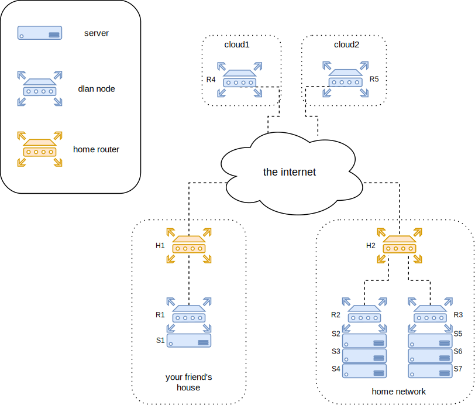
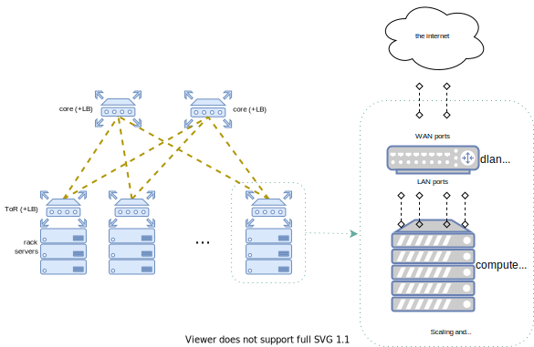

# dlan

- [dlan](#dlan)
    * [Installation and usage](#installation-and-usage)
    * [Target architecture and design](#target-architecture-and-design)
        - [Tradeoffs](#tradeoffs)
    * [F.A.Q.](#faq)
    * [Gotchas](#gotchas)
    * [Future work](#future-work)

dlan (aka Distributed LAN) is an ansible role to setup a geographically distributed private network, for selfhosting your services. A set of routers (OpenWrt nodes) will act as a virtual perimeter, separating your _internal network_ (spanning multiple locations) from the rest of the web, and securely exposing services running behind it.

Features:
- Private, transparent L3 connectivity among internal hosts. Routers will take care of creating an encrypted overlay network (wireguard, VXLAN, OSPF), so that you can just plug a host into a LAN port of any of the routers, to make it securely reachable from any other host and router in the dlan.
- Expose internal services through nginx TCP/UDP loadbalancing, from any dlan router to any internal host, no matter the router's or host's geographical location.
- Partial mesh connectivity of the routers, and OSPF with tunable link costs. You can implement a network resilient to partial failures, and able to prefer local links for minimizing latency.
- One-way peering option: a dlan router can live in a private network that you don't control (e.g. you're not allowed to create port forwardings in a shared house, or there may be other technicians managing the home router that may mess your configuration), and still join the network by peering to another publicly reachable router.
- Do not trust anything beyond the WAN port: dlan routers act as your internal network perimeter, and thus are designed to live between your servers and untrusted networks. E.g. even if you have multiple dlan routers in the same home LAN, they will assume that their upstream home network is untrusted, and encrypt traffic destined to each other.
- Netowrk features: DHCPv4 and DHCPv6 with optional static leases, DNS server, IPv6 support (ULA only)
- Runs on commodity hardware.
- OpenWrt based (may change in the future)

### Installation and usage

Disclaimer: changes to UCI config are performed directly on-disk, and daemons are restarted right after. If there is an issue in the config, you may risk making the device unusable. It's recommended to double-check the produced configurations before applying, and getting familiar with failsafe mode in case things go wrong. Previous experience in Linux administration and OpenWrt is also helps.

Prerequisites:
- One or more OpenWrt routers (>=19.0.2)
- Passwordless root access to the router
- The router can access the internet

Please check the [defaults file](./defaults/main.yml) for a full list of documented role variables.
Also the [dlan-example](https://github.com/mvitale1989/dlan-example) repo provides a ready-to-use VM-based testbed for trying this project out.

### Target architecture and design

Given the following example hardware setup, and assuming you can't control or don't want to rely on H1 or H2's configuration:

- The serverss S1 to S7 are all connected to the LAN port(s) of routers R1, R2 and R3.
- The WAN port of R1, R2 and R3 are connected to the home router of the physical location they're in.
- The routers R4 and R5 are running in on two cloud instances, each of them having a publicly reachable IP. Note they don't have a LAN part to them: they only have a single network interface, acting as a WAN port.

The goal is to have all the dlan routers transparently act like you'd expect from a single LAN. That means for instance:
- All of for the servers (S1 to S7) should be able to communicate privately among themselves independently of their location. The routers should do the tunneling and encryption for passing packets across locations.
- We should be able to expose any service in the internal network to the internet from any location, without relying on H1 or H2's port forwardings. E.g. a service running on server S1 may be reached through R4 or R5's public IP (or both). So dlan routers R1 to R5 will act as your private network edge, and you can create "port forwardings" on each of them to expose any internal service. (spoiler: it's not a NAT rule, but TCP/UDP loadbalancing instead, to be able to use multiple backend servers for the same service).

To achieve the above, each router will run wireguard+VXLAN tunnels for logical connections to other routers, where cross-location traffic will flow through. OSPF is used on these tunnels to flood reachability information and program the router's routing tables, for network resiliency to partial failure and to achieve partial mesh capability. Also nginx is running on each of the routers to expose your internal services.
- The more connections you configure among routers the better, as there'd be less hops involved for cross-location packets, but it's not always possible. E.g. R1 can't reach R2 because they're both behind NAT. But both of them can reach R4 and R5, so they should peer with them. In such a case, packets travelling from R1 to R2 will follow either the `R1 -> R4 -> R2`  or the `R1 -> R5 -> R2` path.
- If there are multiple routers in a single LAN, they should peer to each other. So that the traffic flowing between them goes directly from one to the other.
- dnsmasq is running on all routers for DHCP (IPv4 and IPv6; also RA for IPv6) and DNS services. Static leases are possible. DNS records are created also in absence of static leases, with the hostname declared by the machine doing the DHCP request.
- Each router's DNS server is authoritative for its own LAN, and if they receive a DNS query for a name that another router is responsible for, they will delegate to it. E.g. if R1 is responsible for `r1.lan` domain, and R2 for `r2.lan`, then when R1 receives a query for `myhost.r2.lan` it will transparently ask R2 for the record, and return the received result to the requesting client.
- It's possible to use the proxy protocol towards the upstreams on nginx, if your clients need to get the actual client address of inbound connections.

After programming the routers with as many peerings as we can (as recommended), the logical overview of the above setup (aka _overlay network_) would be as follows:

You may notice that this architecture resembles a redundant hub-and-spoke, with R4 and R5 both acting as hub. However do notice that it's actually a partial mesh, because R2 and R3 are connected, to make  traffic between e.g. S2 and S5 go directly through the LAN (but still tunneled, as the upstream LAN is assumed to be untrusted), instead of hopping through R4 or R5. Architectures where you have routers behind many different NATted networks will tend towards this architecture, but in the ideal case where you control the upstream home routers you should create portforwardings to your router's wireguard ports, and create as many connections as you can; ideally your logical layout would be a full mesh for maximum efficiency (less hops = less latency, less cumulative network bandwidth, less compute resources used).

##### Tradeoffs

dlan's design is inspired by the hyperconverged architecture: to scale your computing capacity, simply add more of the same. In this case, dlan acts as the network portion of such a concept, and the unit of scaling and redundancy is the dlan router along with the servers behind it. You can almost think of the dlan router as a Top-of-Rack switch (or core switch, if it has no LAN portion), and the server connected to its LAN ports as the servers in the same rack cabinet (with due differences, see below).

Redundancy here is achieved by adding more routers, along with more hosts behind them. Each router+server kinda acts as an Availability Zone (or not really, depending on conditions; e.g. if they're in the same house, the Single Point of Failure would still be the home router, or the powerline of your home, etc).

Compared to an enterprise network, you can see some differences due to the design tradeoffs:
- Unicast L3 connectivity only. L2 broadcast and multicast is limited to a single router, and can't be configured otherwise.
- No multihoming: a host may be connected only at one router at once. If a router fails, all the servers behind it are disconnected.
- It's not shown in the graph but the links are wireguard+VXLAN tunnels, and not physical. This means performance is not even comparable for cross-location communication, and there is a performance hit even when two dlan routers are next to each other in the same location (for encrypting the traffic before having it go through the upstream LAN), but that's traded of for the ability to run on extremely simple hardware setups (fit for home usage), plus great flexibility, simplicity and ease of scaling and configuration. Especially clustered services cannot ignore the latency of cross-location traffic.

Some of the above would be solved by an EVPN setup, but the features you get still may be unjustified for home setups (e.g. geographically distributed L2 makes sense in very few select cases, and multihoming is only partially useful if you anyway have other SPoFs). Still, EVPN would definitely need to be considered for future iterations of the project.

### F.A.Q.

- Why is this project called dlan? A LAN is _local_ by definition, how can it be distributed? It's true that the concept of a geographically distributed LAN doesn't make sense (that'd be a WAN technically). The goal of the project is not to create one: it's to replicate the ease of configuration of a LAN in a distributed environment. E.g. many of us expect devices in a LAN to ping each other, and to be able configure port forwardings to expose some services. Dlan tries to achieve this same usability, without being constrained by device location.
- How does mesh networking work? Between each linked pair of routers, there's a wireguard+VXLAN tunnel. So when a packet travels between two adjacent routers, it always does so in a wireguard packet (src/dest IPs are the WAN-side IPs of the two routers), which contains the VXLAN packet (src/dest IPs are the two router's wireguard interfaces' private IPs), which contains the IP payload itself (dst IP here is the actual destination of the packet, and the src is one of the original sender's IPs depending on which IP protocol is used; do note that the IP of the vxlan interfaces themselves only appear in the kernel routing table, written by the bird daemon based on the OSPF mesh informations, and is mainly used for next-hop MAC lookups when routing packets across the internal network). OSPF is used to distribute all subnets a certain router manages on LAN side (plus its loopback address) so that those are reachable by any other router in the mesh.
    * Can't we skip the VXLAN encapsulation, and use wireguard directly? Unfortunately not: OSPF, which is needed to build a resilient IP mesh, needs an L2 link to run as it relies on multicast traffic. Due to the additional peer mapping logic (the AllowedIPs directive is looked up, do decide which peer gets a package), multicast can't work over wireguard, and thus we need to create an L2 tunnel.
    * So if multicast worked over wireguard, it'd be fine? No, even if OSPF worked there'd be another more issue: due to the same peer mapping logic, the source and destination IPs of packets travelling through the wireguard interfaces MUST be those of the peers of the link (unless you configure AllowedIPs for multi-hop scenarios, see next point). VLXAN does the trick here, as no matter the src/dest IPs of your actual IP packets, as soon as they enter a vxlan interface they will get encapsulated in a vxlan packet that has the src/dest addresses of the src/dest wireguard interfaces of the routers in this hop (only adjacent routers in the mesh are vxlan peers, so it's always a single-hop for any vxlan-encapsulated frame).
    * But can't i theoretically configure wireguard so that AllowedIPs enumerates all subnets that are reachable by that peer? Theoretically yes, but to have it be autonomous you still need an IGP protocol for monitoring reachability informations, and the bird daemon doesn't support writing the wireguard config. And even if it did you could only list a route behind a single peer (due to the peer mapping logic), which is not what is expected from an IGP protocol (where a single route may be reachable through different routers, achieving ECMP).
- I see that the wireguard IP is as unique as the loopback IPs in the mesh; can't we use those instead of loopbacks, so we save a subnet? No, we can't unfortunately. The loopback address should be advertised through OSPF for global reachability within the mesh, and we can't do it with the wireguard IP: if the wireguard IP is advertised through OSPF to the other routers, it would break the connectivity with all of its adjacent routers, due to conflicting routes.
    * Why is there a conflict? Each node already has `/32` routes to its wireguard peers (= adjacent routers), before OSPF even runs; packets destined to a certain wireguard peer MUST enter the wireguard interface (where the kernel module itself does the demultiplexing, looking at the AllowedIPs of all peers). Then bird starts, and begins receiving route infos through OSPF: for each known subnet, it writes an entry in the kernel routing table, so that packets between routers will travel through the same link where OSPF protocol runs, and that means the VXLAN interface in dlan's case. This means: if OSPF were to advertise the wireguard IPs, then it would write in the routing table that packets destined to wireguard IPs of adjacent routers should be sent THROUGH the vxlan interface...which conflicts with the initial assumption that wireguard packets must enter the wireguard interface. As the wireguard IPs are used as the vxlan interfaces' endpoint IPs, the vxlan tunnels will of course also not work either, and connectivity is broken.
- Why use dnsmasq-dhcpv6? Isn't odhcpd enough? odhcpd seems to do its job just fine as an IPv6 DHCP server. The issue here is the separation between dnsmasq and odhcpd, which may hold configuration surpri
ses we'd rather avoid.
    * For instance: if both are used (as DHCP servers; dnsmasq for IPv4 and odhcpd for IPv6), the way OpenWrt integrates them to serve IPv6 records (as dnsmasq knows nothing about those leases) is to have odhcpd write its leases to a file, and dnsmasq pick those up through that file with the `addn-hosts` flag. However, I hit an out-of-the-box bug in 19.07.2 in which dnsmasq couldn't read the file written by odhcpd due to permission issues. Using dnsmasq also for DHCPv6 we remove this additional possible failure point.
- Is DHCP-PD used? No, IPv6 support is limited to static configuration of prefixes for downstream interfaces.
- Can i give downstream interfaces global IPv6 ranges? No, only private network addresses are supported (E.g. ULA). nginx will always stand between clients and your services.
- Can i have a static DNS entry pointing to multiple IPs? Yes, simply create separate entries under `dlan_host_records` that have the same name but different IPs.
- Which VXLAN IDs are used among hosts? A value is autogenerated per-host-pair number, using `dlan_maxhosts`, so that it's guaranteed to be unique in the whole mesh.
- Does OSPF advertise also the WAN network? No, that's not supported. The dlan network doesn't care about what's beyond the WAN port, there are only clients and dragons there. It's also impossible to guarantee that the network behind it is unique, as it's not under the router control and e.g. most home network use ranges `192.168.0.0/24` or `192.168.1.0/24`.
- Why not use NAT table rules instead of nginx, for exposing services? Or why not HAproxy? The NAT table rules limit the number of upstream IPs to 1, which is not ideal asd you may want to expose your service through multiple servers (e.g. think kubernetes NodePort services). HAproxy does not support UDP loadbalacing.
- Can two routers live in the same home LAN? Yes, they can. You can peer them to each other by using their private IPs, so that traffic between the two will travel through the home LAN (still encrypted).
    * Do remember that in all cases, dlan routers may talk to each other only through their WAN interface. Any other combination (e.g. LAN port of a router connected to another router's LAN, or to another router's WAN) is not supported. Only client machines (that is, the machines running your services in the internal network) should be connected to the LAN ports.

### Gotchas

- To have the reverse proxy (nginx) listen on all IPv4 and IPv6 addresses for a port, the listen string should be e.g. `[::]:80` (the `ipv6only=off` flag is always set).
- Under very specific circumstances, nginx may require a manual restart. This is required if you change the proxy entries after switching to a more specific IP for a certain port (e.g. you used to listen on `0.0.0.0:8080`, but now you listen on `192.168.1.5:8080`): nginx won't be able to actually perform this change until its full restart, as it needs to unbind from the port before being able to bind again to the more specific address.
- Also nginx may require a reload if a DNS record used in one of the upstreams (`dlan_proxy` parameter) changes. Unfortunately, in the open source version of nginx does not update the DNS records over time. There's a trick that lets you also achieve that (don't use upstreams, use variables inside of the `proxy_pass` directive), but it only works for HTTP proxying, so we're out of luck.
- Some older versions of ansible (e.g. `2.8.1` is affected by this) may fail to cleanup the ansible tmpfile directory on the remote host, leading to the device filesystem filling up quickly. Upgrade your ansible installation to fix this.
- If you have traffic between multiple routers behind a single home network, but notice that the latency is unusually high, probably traffic is flowing through other locations and then goes back to the LAN where its destination is. In that case you should tune the OSPF link costs so that the local link is preferred.

Some OpenWrt packages that may be useful for debugging issues are: `ip-full`, `ip-bridge`

### Future work

Functional improvements:
- Multiple public IPs for WAN (see TODO in `defaults/main.yml`)
- Support debian linux machines, in addition to (or instead of) OpenWrt
- Add PXE boot features
- Create automatioun around nginx reloads, on DNS record changes
- Add reverse DNS entries
- Support internal CNAME/SRV/TXT DNS Records
- Make it possible to inject non-dlan VPN client keys (e.g. you may want to use the VPN from a laptop)
- Add rules to have traffic from a certain VPN client go out of a certain router
- Implement EVPN, to support distributed L2 segments and multihoming.

Nice-to-haves and cleanups:
- Use only one VXLAN interface per-router, instead of one per-router-pair, using static FIB entries, if possible
- Autogenerate `dlan_id`, instead of having the user set them explicitly (e.g. generate from the inventory name)
- Generate IPs for the current host (e.g. loopack/wg ipv4/v6) once, in a single place (e.g. `default/internal.yml`), instead of computing them at every place
- Use `dlan_maxhosts` to generate all subnet masks
- Have a user other than `root` be the one for connecting, for extra security against bruteforcing
