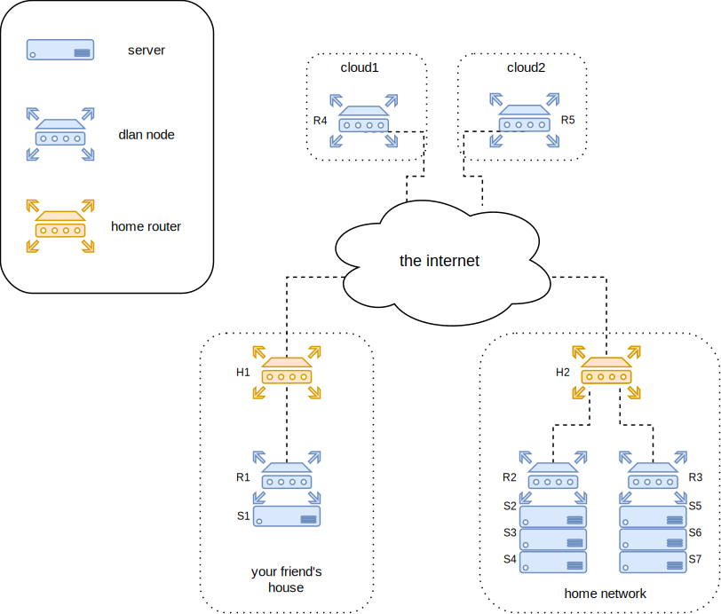
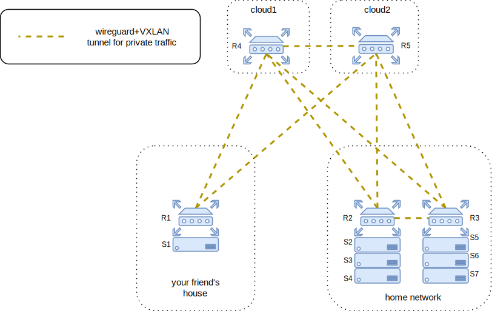

# Target architecture and design

- [Goal of the project](#target-architecture-and-design)
- [Architecture](#architecture)
- [Tradeoffs](#tradeoffs)

Use case of this project: you want to host some services, but...
- You want to own the hardware they run on
- You have multiple places you run your own hardware in (e.g. your home, your vacation home, your friend's house, your grandma's...)
- You want to expose your services to the public internet
- You don't want to depend on the configuration of environment they run in (e.g. portforwarding rules of the home network your hardware runs in)
- You don't want the host configuration to care about networking (e.g. no routing daemons on the hosts) nor firewalling. It assumes that it's plugged to a private network, gets its private IP and default gateway and it's set.
- You want all of the above to be easily manageable

dlan tries to take care of these networking requirements for you. So it's about building a WAN (connecting locations where your hardware runs in) that's as easy to configure as a home LAN.

### Architecture

Given the following example hardware setup, and assuming you can't control (or don't want to rely on) H1 or H2's configuration:

- The servers S1 to S7 are all connected to the LAN port(s) of routers R1, R2 and R3.
- The WAN ports of R1, R2 and R3 are connected to the home router of the physical location they're in. They're said to be _cascaded_ to the home routers.
- The routers R4 and R5 are running on two cloud instances, each of them having a publicly reachable IP. Note they don't have a LAN portion: they only have a single network interface, which acts as a WAN port.

The goal is to have all the dlan routers collectively act pretty much as you'd expect from a single home router. Examples of these expectations of a home network are:
- _"Plug a cable in a LAN port to connect to the internal network"_: LAN ports of all routers should transparently act as a single private network. So all of the servers (S1 to S7) should be able to communicate privately among themselves independently of their location. The routers should do the tunneling and encryption for passing packets across locations.
- _"I can expose internal services to the outside world through port forwarding entries"_: we should be able to expose any service in the internal network to the internet from any location, without relying on H1 or H2's port forwardings. E.g. a service running on server S1 may be reached through R4 or R5's public IP (or both). Technically, dlan routers R1 to R5 act as your private network edge.

To achieve the above, each router will run wireguard+VXLAN tunnels for logical connections to other routers, through which cross-location traffic will flow. OSPF is used on these tunnels to flood reachability information and program the router's routing tables, for network resiliency to partial failure and to achieve partial mesh capability. Also nginx is running on each of the routers to expose your internal services through TCP/UDP loadbalancing.
- The more connections you configure among routers the better, as there'd be less hops involved for cross-location packets in the resulting mesh, but it's not always possible. E.g. R1 can't directly reach R2 because they're both behind NAT, so a logical connection between them is impossible. But, both of them can reach R4 and R5, so they should peer with them. In such a case, packets travelling from R1 to R2 will follow either the `R1 -> R4 -> R2`  or the `R1 -> R5 -> R2` path.
- If there are multiple routers in a single LAN (e.g. `R2` and `R3`), they should peer to each other. So that the traffic flowing between them goes directly from one to the other.
- dnsmasq is running on all routers for DHCP (IPv4 and IPv6; also for RA services for IPv6) and DNS services. Static leases are possible. DNS records are created even in absence of a static lease, using the hostname declared by the machine doing the DHCP request.
- Each router's DNS server is authoritative for its own LAN, and if they receive a DNS query for a name that another router is responsible for, they will delegate to it. E.g. if R1 is responsible for `r1.lan` domain, and R2 for `r2.lan`, then when R1 receives a query for `myhost.r2.lan` it will transparently ask R2 for the record, and return the received result to the requesting client.
- It's possible to use the proxy protocol towards the upstreams on nginx, if your clients need to get the actual client address of inbound connections.

After programming the routers with as many peerings as we can (as recommended), the logical overview of the above setup (aka _overlay network_) would be as follows:

You may notice that this architecture resembles a redundant hub-and-spoke VPN, with R4 and R5 both acting as hub. However do notice that it's actually a partial mesh, because R2 and R3 are connected, to have the traffic between e.g. S2 and S5 go directly through the LAN (but still encrypted, as the upstream LAN is assumed to be untrusted), instead of hopping through R4 or R5. Infrastructure where you have routers behind many different NATted networks will tend towards this architecture, but in the favourable case where you control the upstream home routers you should create portforwardings to your router's wireguard ports, and create as many connections as you can; ideally your logical layout would be a full mesh for maximum efficiency (less hops = less latency, less cumulative network bandwidth, less compute resources used).

### Tradeoffs

dlan's design is inspired by the hyperconverged architecture: to scale your computing capacity, simply add more of the same. In this case, dlan acts as the network portion of such a concept, and the unit of scaling and redundancy is the dlan router along with the servers behind it. You can almost think of the dlan router as a Top-of-Rack switch (or core switch, if it has no LAN portion), and the server connected to its LAN ports as the servers in the same rack cabinet (with due differences, see below).

Redundancy here is achieved by adding more routers, along with more hosts behind them. Each router+server kinda acts as an Availability Zone (or not really, depending on conditions; e.g. if they're in the same house, the Single Point of Failure would still be the home router, or the powerline of your home, etc).

Compared to an enterprise network, you can see some differences due to the design tradeoffs:
- Unicast L3 connectivity only. L2 broadcast and multicast is limited to a single router, and can't be configured otherwise.
- No multihoming: a host may be connected only at one router at once. If a router fails, all the servers behind it are disconnected.
- Performance is suboptimal, and is traded off for radically simpler hardware setups (commodity hardware and trivial cabling, fit around home usage by design), flexibility, simplicity and ease of scaling and configuration. For instance:
    * For dlan routers in the same location (e.g. behind the same home router), there is the performance hit in communication due to wireguard+VXLAN encapsulation, as we don't trust the upstream LAN by principle. Ideally you'd have physical link connecting those (although encapsulation usually happens in enterprise networks as well).
    * The assumption that we run on generic commodity router devices (due to targeting home usage) means that we possibly don't make use of certain hardware tuning we could benefit from.
    * By design, we rely on the public internet that a home user has access to. By contrast, enterprise networks may have ad-hoc ISP links for faster cross-location communication. Especially clustered services cannot ignore the latency of cross-location traffic, in dlan.

Some of the above would be solved by an EVPN, but the features you get still may be unjustified for home setups (e.g. geographically distributed L2 makes sense in very few select cases, and multihoming is only partially useful if you anyway have other SPoFs at home). Still, EVPN would definitely need to be considered for future iterations of the project, to support more use cases.
